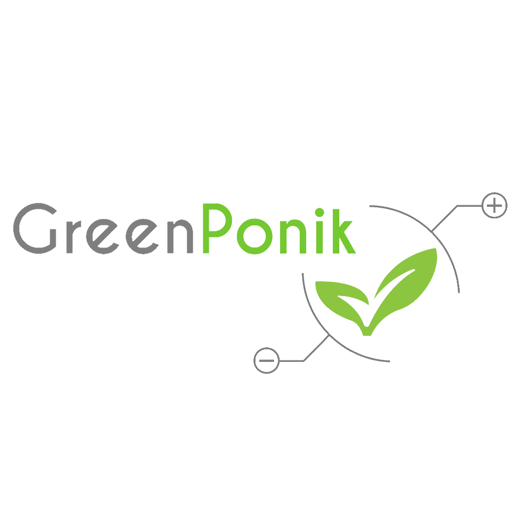

 

<h1> GreenPonik Desktop App</h1>

 

With <a href="https://www.greenponik.com" target="_blank">GreenPonik</a> Desktop App take the control of you hydroponics setup brain by <a href="https://www.greenponik.com" target="_blank">GreenPonik</a>.
 
<a href="https://www.greenponik.com/en/our-products/hub" target="_blank">Hub</a>, <a href="https://www.greenponik.com/en/our-products/water-sensor" target="_blank">WaterSensor</a>, <a href="https://www.greenponik.com/en/our-products/pump" target="_blank">WaterPump</a> are controlled from you laptop 

## Releases

- [Windows installer]()
- [Windows portable executable]()
